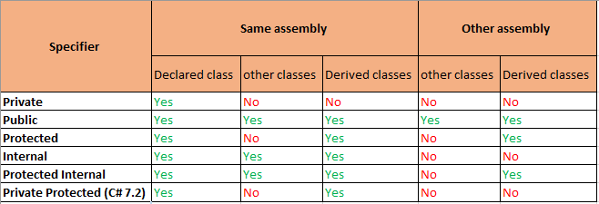
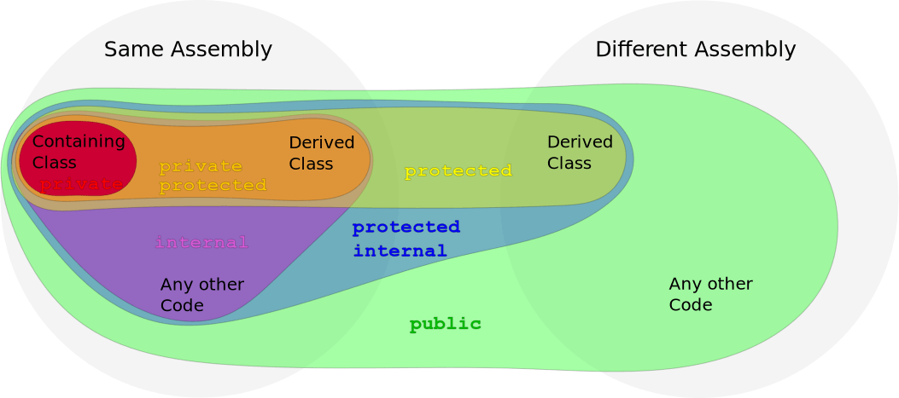

# C Sharp Access Modifiers Overview

(From https://stackoverflow.com/a/51241984/165106)

(From https://stackoverflow.com/a/54803483/165106)

## From [docs.microsoft.com](https://docs.microsoft.com/en-us/dotnet/csharp/programming-guide/classes-and-structs/access-modifiers):

### public

The type or member can be accessed by any other code in the same assembly or another assembly that references it.

### private

The type or member can only be accessed by code in the same class or struct.

### protected

The type or member can only be accessed by code in the same class or struct, or in a derived class.

### private protected (added in C# 7.2)

The type or member can only be accessed by code in the same class or struct, or in a derived class from the same assembly, but not from another assembly.

### internal

The type or member can be accessed by any code in the same assembly, but not from another assembly.

### protected internal

The type or member can be accessed by any code in the same assembly, or by any derived class in another assembly.

When no access modifier is set, a default access modifier is used. So there is always some form of access modifier even if it's not set.